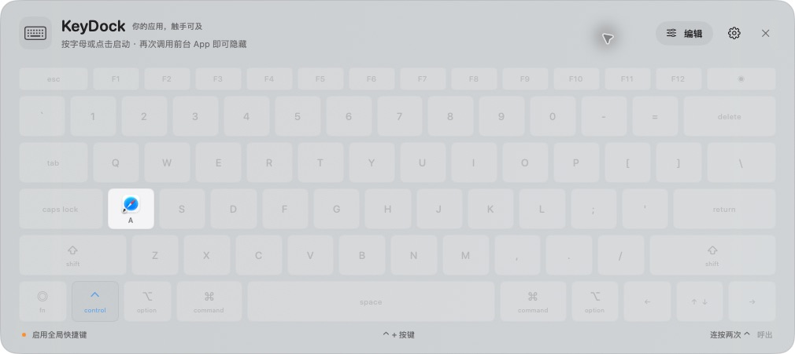

# KeyDock

用一张键盘，启动、切换和隐藏 Mac 上的应用。

KeyDock 是一个原生 macOS 菜单栏工具。你可以把应用放到对应键帽上，通过 **统一前缀 + 按键** 直接调用，也可以 **双击修饰键** 呼出半透明键盘，再按字母或点击图标。



> 截图为示例绑定。首次使用没有预设应用，请按自己的习惯配置。

[使用指南](docs/USAGE.md) · [更新记录](CHANGELOG.md) · [验证记录](docs/QA.md)

## 功能

- **应用快捷切换**：未运行则启动，在后台则显示，在前台则隐藏。
- **键盘式配置**：字母、数字和标点键可绑定应用，键帽显示本机应用图标；同一应用可以绑定多个键。
- **双击呼出**：默认快速单独按两次 Control，面板显示在鼠标所在屏幕中央。
- **独立设置**：启动前缀与双击呼出键可分别选择 Control、Command、Option、Shift 或 Fn／地球键。
- **菜单栏常驻**：打开面板、编辑绑定、暂停快捷键、设置登录时启动；默认不显示 Dock 图标。
- **本机保存**：配置即时写入本地 JSON，无需账号、数据库或网络服务。
- **原生界面**：SwiftUI + AppKit，半透明面板随系统切换深浅色；设置页使用普通独立窗口。

## 系统要求

| 项目 | 要求 |
| --- | --- |
| 处理器 | Apple Silicon（M 系列，arm64） |
| 系统 | macOS 14 或更新版本 |
| 全局快捷键 | 需要允许 KeyDock 使用辅助功能权限 |
| 从源码构建 | 完整 Xcode、Swift 5.9 或更新工具链 |
| 当前版本 | 1.0.4 |

当前为本机使用版本，未进行 Developer ID 公证或 App Store 分发，不含自动更新和云同步。开发证书签名不等于公证，在其他 Mac 上运行仍受系统安全检查约束。

## 安装与首次使用

### 1. 安装应用

获取已构建的 `KeyDock.app`，或按下文从源码构建。Git 仓库忽略 `dist/`，克隆源码不会附带应用安装包。

将 `KeyDock.app` 放入 `/Applications` 或 `~/Applications`，再双击打开。建议固定安装位置后再授权。应用启动后常驻菜单栏，可点击键盘图标 → **打开键盘面板**。

### 2. 配置一个绑定

以 **A → Safari** 为例：

1. 打开键盘面板，点击右上角 **编辑**。
2. 点击 **A** 键帽，搜索并选择 **Safari**。
3. 点击面板右上角 **完成**，退出编辑模式。

找不到应用时，点击 **从文件选择…**，手动选择 `.app`。绑定会立即保存。

### 3. 开启辅助功能权限

打开 KeyDock **设置** → **打开辅助功能设置**，在 macOS **隐私与安全性 → 辅助功能** 中添加当前安装的 `KeyDock.app` 并开启开关；身份确认在系统窗口中完成。

返回 KeyDock 设置，点击 **重新检测**。正常状态应显示 **快捷键监听正常**。完成后关闭设置页。没有权限时，仍可配置绑定和用鼠标调用应用。

### 4. 开始使用

| 操作 | 默认方式 |
| --- | --- |
| 调用 A 绑定的应用 | `Control + A` |
| 呼出或收起键盘面板 | 单独快速按下并松开 Control 两次 |
| 在面板内调用应用 | 直接按对应字母、数字或标点，或点击键帽 |
| 关闭面板 | `Esc`、点击外部或右上角关闭按钮 |
| 修改绑定 | 面板 **编辑** → 点击键帽 → 选择或清除应用 |
| 暂停全局快捷键 | 菜单栏键盘图标 → **暂停全局快捷键** |

应用调用后面板自动收起。如果目标应用已经在前台，再调用一次会隐藏它。通过面板调用时，以**面板打开前的前台应用**判断是否隐藏。

双击需要两次完整短按，时间上限为 350 毫秒；长按、慢速双击或期间混入其他键不会呼出。编辑模式、应用选择器和获得焦点的设置页会暂停全局触发。

更多操作与排查步骤见 [完整使用指南](docs/USAGE.md)。

## 从源码构建

```sh
git clone https://github.com/2911448/keyDock.git
cd keyDock
./scripts/test.sh
# 先从菜单栏退出正在运行的 KeyDock，再构建。
./scripts/build.sh
```

输出为 `dist/KeyDock.app`。构建脚本会打包原生 arm64 可执行文件和图标，并执行签名验证。

脚本在本机存在 `/Applications/Xcode-beta.app` 时优先使用该工具链，不修改系统的 `xcode-select` 设置。也可指定完整 Xcode：

```sh
DEVELOPER_DIR=/Applications/Xcode.app/Contents/Developer ./scripts/test.sh
DEVELOPER_DIR=/Applications/Xcode.app/Contents/Developer ./scripts/build.sh
```

默认选用钥匙串中已有的 **Apple Development** 签名身份；找不到时会报错。可指定自己的签名身份：

```sh
KEYDOCK_SIGNING_IDENTITY="你的签名身份名称或 SHA-1" ./scripts/build.sh
```

没有开发证书时，仅用于本机临时测试可以显式使用 ad-hoc 签名：

```sh
KEYDOCK_SIGNING_IDENTITY=- ./scripts/build.sh
```

临时签名在重新构建后可能需要重新授权。持续开发应使用同一证书和固定应用位置。脚本不会创建或上传证书，并会拒绝覆盖正在运行的 KeyDock。设置 `CONFIGURATION=debug` 可以生成调试版本。

## 项目结构

```text
KeyDock/
├── Package.swift             # Swift Package 定义
├── Info.plist                # 应用标识、版本和系统要求
├── Sources/
│   ├── KeyDockCore/          # 配置、物理键位、手势和应用切换规则
│   └── KeyDock/              # 界面、窗口、全局监听和系统应用调用
├── Tests/                    # 核心规则与应用层回归测试
├── scripts/                  # 构建、测试和图标生成脚本
├── docs/                     # 使用指南、截图和验证记录
└── dist/                     # 本地构建产物，不提交 Git
```

新需求和修复在功能分支实现，同一任务沿用同一分支。当前开发分支为 `feat/keydock`，不在 `main`、`master` 或 `test` 分支直接开发，也不将 `test` 合并到主干。

## 配置与隐私

配置保存在：

```text
~/Library/Application Support/KeyDock/settings.json
```

使用带版本号的 JSON 原子写入，保存按键、应用标识和应用路径。应用移动后会尝试按标识重新定位；配置损坏时保留原文件，由用户在设置中选择备份并重置。

KeyDock 不记录输入内容、不上传键盘数据。设置页中的事件数、双击次数和最近操作只用于当前运行期间的诊断。个人绑定保存在 Application Support，不在项目仓库中。

## 限制与验证

- 当前采用 ANSI Mac 键盘布局，ISO/JIS 额外按键暂不提供绑定。按物理键位匹配，不依赖输入法生成的字符。
- 已绑定的组合键会优先被 KeyDock 处理，例如设置 `Command + A` 会影响其他应用的“全选”；未绑定组合正常传递。
- 部分系统保留快捷键无法覆盖；Fn／地球键可能被系统功能占用，部分外接键盘的 Fn 不向系统发送事件。
- 暂停全局快捷键后仍可从菜单栏打开面板，使用鼠标或面板内按键调用应用。
- 当前 25 项测试通过；已实机验证面板配置与通过键帽显示、隐藏微信。完整实体快捷键、睡眠唤醒、多屏和全屏空间等场景仍需按 [验证记录](docs/QA.md) 回归。实际验证环境为 macOS 27 / Xcode 27 beta，尚未在 macOS 14 设备上运行。
